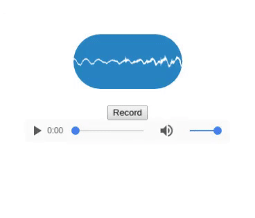

# react-mic-record #

Record a user's voice and display as an osscilation.


Works via the HTML5 MediaRecorder API ([currently only available in Chrome & Firefox](https://caniuse.com/#search=MediaRecorder)).

## Demo ##

Check out the demo.


## Installation ##

`npm install --save react-mic-record`

## Features ##

- Record audio from microphone
- Display sound wave as voice is being recorded
- Get audio as BLOB

## Usage ##

```js

<ReactMicRecord
  record={boolean}         // defaults -> false.  Set to true to begin recording
  className={string}       // provide css class name
  onData={function}        // callback to execute when chunk of audio data is available
  onStop={function}        // callback to execute when audio stops recording
  strokeColor={string}     // sound wave color
  backgroundColor={string} // background color
/>

```

## Example ##



```js
import { ReactMicRecord } from 'react-mic-record';

export class Example extends React.Component {
  constructor(props) {
    super(props);
    this.state = {
      record: false
    }

  }

  startRecording = () => {
    this.setState({
      record: true
    });
  }

  stopRecording = () => {
    this.setState({
      record: false
    });
  }

  onData(recordedBlob) {
    console.log('chunk of real-time data is: ', recordedBlob);
  }

  onStop(recordedBlob) {
    console.log('recordedBlob is: ', recordedBlob);
  }

  render() {
    return (
      <div>
        <ReactMicRecord
          record={this.state.record}
          className="sound-wave"
          onStop={this.onStop}
          strokeColor="#000000"
          backgroundColor="#FF4081" />
        <button onTouchTap={this.startRecording} type="button">Start</button>
        <button onTouchTap={this.stopRecording} type="button">Stop</button>
      </div>
    );
  }
}
```

## Credits ##

This package uses code from ([react-mic](https://github.com/hackingbeauty/react-mic)).

## License ##

MIT


